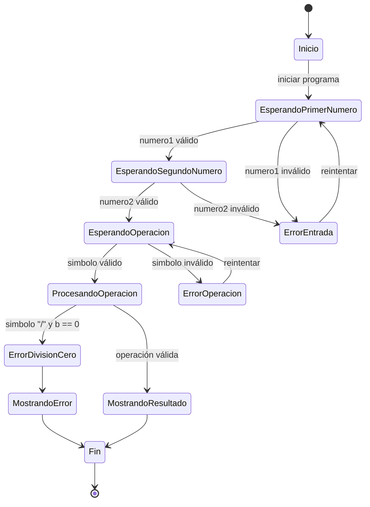

```mermaid
stateDiagram-v2

[*] --> Inicio

Inicio --> EsperandoPrimerNumero : iniciar programa
EsperandoPrimerNumero --> EsperandoSegundoNumero : numero1 válido
EsperandoPrimerNumero --> ErrorEntrada : numero1 inválido

ErrorEntrada --> EsperandoPrimerNumero : reintentar

EsperandoSegundoNumero --> EsperandoOperacion : numero2 válido
EsperandoSegundoNumero --> ErrorEntrada : numero2 inválido

EsperandoOperacion --> ProcesandoOperacion : simbolo válido
EsperandoOperacion --> ErrorOperacion : simbolo inválido

ErrorOperacion --> EsperandoOperacion : reintentar

ProcesandoOperacion --> ErrorDivisionCero : simbolo "/" y b == 0
ProcesandoOperacion --> MostrandoResultado : operación válida

ErrorDivisionCero --> MostrandoError

MostrandoResultado --> Fin
MostrandoError --> Fin

Fin --> [*]
```
