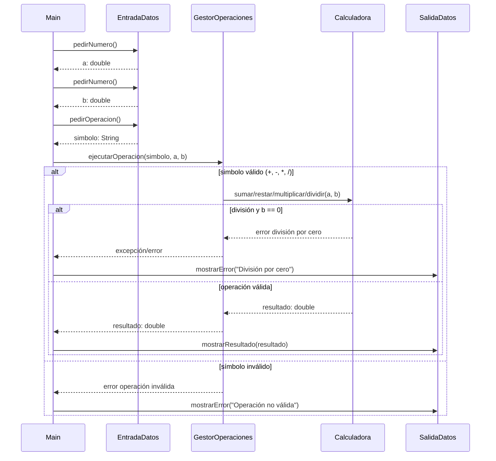

```mermaid
sequenceDiagram

participant Main
participant EntradaDatos
participant GestorOperaciones
participant Calculadora
participant SalidaDatos

Main->>EntradaDatos: pedirNumero()
EntradaDatos-->>Main: a: double

Main->>EntradaDatos: pedirNumero()
EntradaDatos-->>Main: b: double

Main->>EntradaDatos: pedirOperacion()
EntradaDatos-->>Main: simbolo: String

Main->>GestorOperaciones: ejecutarOperacion(simbolo, a, b)

alt simbolo válido (+, -, *, /)
    GestorOperaciones->>Calculadora: sumar/restar/multiplicar/dividir(a, b)
    
    alt división y b == 0
        Calculadora-->>GestorOperaciones: error división por cero
        GestorOperaciones-->>Main: excepción/error
        Main->>SalidaDatos: mostrarError("División por cero")
    else operación válida
        Calculadora-->>GestorOperaciones: resultado: double
        GestorOperaciones-->>Main: resultado: double
        Main->>SalidaDatos: mostrarResultado(resultado)
    end

else símbolo inválido
    GestorOperaciones-->>Main: error operación inválida
    Main->>SalidaDatos: mostrarError("Operación no válida")
end
```
